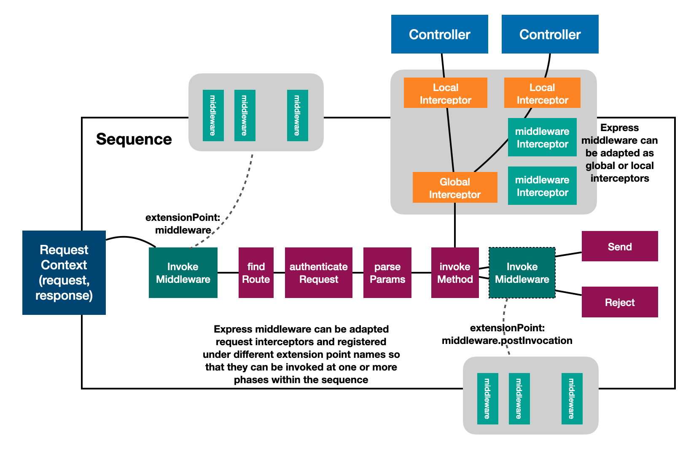

## Overview

Node.js web frameworks such as `Express` and `Koa` use middleware as the basic
building blocks to compose a pipeline of functions that handles HTTP requests
and responses.

LookBack 4 leverages Express behind the scenes for its REST server
implementation. We decided to not expose middleware capabilities to users while
we pursue an elegant and non-invasive way to fit Express middleware into the
LoopBack 4 programming model nicely. Meanwhile, we have received various
requests and questions from our users on how to use Express middleware with
LoopBack 4 or migrate their usage of Express middleware from LoopBack 3 to
LoopBack 4.

## LoopBack style middleware

Built on top of idea of interceptors, middleware is specialized functions that
work with the `MiddlewareContext` - a wrapper object for `request` and
`response`. The signature is of `Middleware` is:

```ts
import {MiddlewareContext} from '@loopback/express';
import {Next, ValueOrPromise, InvocationResult} from '@loopback/context';

(context: MiddlewareContext, next: Next) => ValueOrPromise<InvocationResult>;
```

For example, a simple logging middleware can be created and registered as
follows.

```ts
const log: Middleware = async (middlewareCtx, next) => {
  const {request} = middlewareCtx;
  console.log('Request: %s %s', request.method, request.originalUrl);
  try {
    // Proceed with next middleware
    await next();
    // Process response
    console.log(
      'Response received for %s %s',
      request.method,
      request.originalUrl,
    );
  } catch (err) {
    // Catch errors from downstream middleware
    console.error(
      'Error received for %s %s',
      request.method,
      request.originalUrl,
    );
    throw err;
  }
};

app.middleware(log);
```

### Why not use Express middleware as-is?

You may wonder why we don't expose Express middleware directly. There are some
gaps in Express middleware that we would like to close to better align with
LoopBack's architecture.

1. Express middleware are one-way handlers that mostly process requests and
   there is no first-class facility to handle responses. We would love to
   support
   [Koa style middleware](https://github.com/koajs/koa/blob/master/docs/guide.md#writing-middleware)
   that use `async/await` to allow cascading behaviors.
2. Express middleware are added by the order of `app.use()` and it's hard to
   contribute middleware from other modules.
3. Express does not allow dependency injection. We would like to enable
   injection of middleware configurations.

To harvest the best of breeds of both frameworks, we build the integration on
top of the [interceptor](Interceptors.md) with community input as illustrated in
the diagram below:



In the diagram, a specialized type of interceptors is introduced as `Middleware`
for LoopBack. Our middleware is basically a function with the signature:

LoopBack organizes middleware into one or more extension points exposed by
`InvokeMiddleware` providers. Middleware are registered as extensions. Within
the sequence, when `invokeMiddleware` is executed, a chain is formed with
discovered middleware, which are then invoked in a cascading fashion.

Please note that `Middleware` and related concepts are inherited from
interceptors.


### Introduce middleware to REST sequence of actions

There are a few actions involved in the default sequence. See `Sequence.md` for
more details.

It's often desirable to reuse Express middleware in the sequence to handle API
requests/responses without reinventing the wheel. We now add an
`InvokeMiddleware` action as the first step in the default sequence. The action
itself is an interceptor chain of `MiddlewareContext`. It uses the powerful
[extension point/extension pattern](Extension-point-and-extensions.md) to
discover registered Express middleware and invoke them as a chain.

#### Default sequence

The generated `src/sequence.ts` now has a new `middleware` property to
`DefaultSequence` to allow injection of the middleware chain while keeping
backward compatibility of the constructor.



```ts
export class DefaultSequence implements SequenceHandler {
  /**
   * Optional middleware chain
   * Invokes registered middleware (injected via SequenceActions.MIDDLEWARE).
   */
  @inject(SequenceActions.MIDDLEWARE, {optional: true})
  protected invokeMiddleware: InvokeMiddleware = () => false;

  // ...
  async handle(context: RequestContext): Promise<void> {
    try {
      const {request, response} = context;
      const finished = await this.invokeMiddleware(context);
      if (finished) return;
      const route = this.findRoute(request);
      const args = await this.parseParams(request, route);
      const result = await this.invoke(route, args);

      debug('%s result -', route.describe(), result);
      this.send(response, result);
    } catch (error) {
      this.reject(context, error);
    }
  }
}
```

#### Extend sequence with more than one middleware actions

Sometimes we want to add middleware to the sequence in between other actions,
for example, do some post-processing before the result is written to the HTTP
response. This can be achieved by overriding the sequence implementation to call
`invokeMiddleware` as needed.



```ts
export class SequenceWithMiddleware extends DefaultSequence {
  async handle(context: RequestContext): Promise<void> {
    try {
      const {request, response} = context;
      // The default middleware chain
      await this.invokeMiddleware(context);
      const route = this.findRoute(request);
      const args = await this.parseParams(request, route);
      const result = await this.invoke(route, args);

      // The second middleware chain for post-invocation processing
      context.bind('invocation.result').to(result);
      // POST_INVOCATION_MIDDLEWARE is the name of the extension point
      // for post-invocation middleware
      await this.invokeMiddleware(context, {
        extensionPoint: POST_INVOCATION_MIDDLEWARE,
      });
      this.send(response, result);
    } catch (error) {
      this.reject(context, error);
    }
  }
}
```

It's also possible to inject multiple instances of `InvokeMiddleware`, each of
which has its own extension point name.



```ts
export class SequenceWithMiddleware extends DefaultSequence {
  /**
   * Optional middleware chain
   * Invokes registered middleware (injected via SequenceActions.MIDDLEWARE).
   */
  @inject('middleware.postInvoke', {optional: true})
  protected middlewarePostInvoke: InvokeMiddleware = () => {};

  async handle(context: RequestContext): Promise<void> {
    try {
      const {request, response} = context;
      // The default middleware chain
      await this.invokeMiddleware(context);
      const route = this.findRoute(request);
      const args = await this.parseParams(request, route);
      const result = await this.invoke(route, args);

      // The second middleware chain for post-invocation processing
      context.bind('invocation.result').to(result);
      await this.middlewarePostInvoke(context);
      this.send(response, result);
    } catch (error) {
      this.reject(context, error);
    }
  }
}
```

Now we can set up applications to leverage the new sequence:



```ts
export class MyApplication extends RestApplication {
  constructor(config: ApplicationConfig) {
    // Create another middleware phase. This is NOT needed if we use the same
    // `invokeMiddleware` with different extension point names.
    this.bind('middleware.postInvoke')
      .toProvider(InvokeMiddlewareProvider)
      .tag({[CoreTags.EXTENSION_POINT]: POST_INVOCATION_MIDDLEWARE});
    this.sequence(SequenceWithMiddleware);

    // Register a middleware
    // `spy` is the factory function of a middleware
    //
    const spyBinding = this.expressMiddleware(spy, undefined, {
      key: 'middleware.spy',
      extensionPointName: POST_INVOCATION_MIDDLEWARE,
    })
      // Set the scope to be `TRANSIENT` so that the new config can be loaded
      .inScope(BindingScope.TRANSIENT);

    this.configure<SpyConfig>(spyBinding.key).to({action: 'log'});
  }
}
```

### Register middleware to be executed by `InvokeMiddleware` actions

To use existing Express middleware, please check out
[Using Express Middleware](./Express-middleware.md).



```ts
import {ApplicationConfig} from '@loopback/core';
import {RestApplication} from '@loopback/rest';
import {log} from './log-middleware';

export class MyApplication extends RestApplication {
  constructor(config: ApplicationConfig) {
    this.middleware(log);
  }
}
```

Middleware can also be contributed using components.

```ts
import morgan from 'morgan';
import {Component} from '@loopback/core';
import {
  createMiddlewareBinding,
  defineInterceptorProvider,
} from '@loopback/express';

const binding = createMiddlewareBinding(defineInterceptorProvider(morgan));
class MyComponent implements Component {
  bindings = [binding];
}
app.configure(binding.key).to({});
app.component(MyComponent);
```
